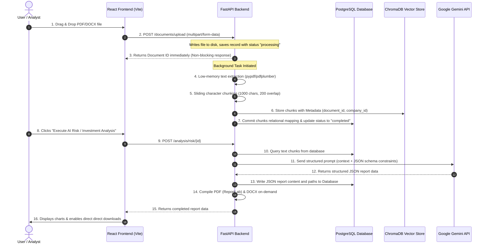

# DueDiligence Pro AI - Technical Architecture & Interview Prep Guide

Welcome to the comprehensive technical guide for **DueDiligence Pro AI**. This document is designed to give you a complete, end-to-end understanding of the project's codebase, data flows, architectural decisions, challenges, and mock interview questions so you can confidently explain the project to recruiters and technical interviewers.

---

## 1. Project Overview & Tech Stack Selection

**DueDiligence Pro AI** is a recruiter-grade, multi-tenant SaaS application that processes corporate filings, contracts, and pitch decks to generate executive compliance risk audits, VC/PE investment evaluations, and isolated semantic chats using LLM retrieval-augmented generation (RAG).

### 🛠️ The Tech Stack
* **Frontend**: React 19, TypeScript, Vite, Ant Design (AntD), Axios, Recharts
* **Backend**: FastAPI (Python), Uvicorn, SQLAlchemy (ORM)
* **Databases**: PostgreSQL (Production), SQLite (Fallback), ChromaDB (Vector Database)
* **AI & Parsing**: Google Gemini 2.5 Flash API, `pypdf`, `pdfplumber`, `python-docx`
* **Reports**: ReportLab (Dynamic PDFs), `python-docx` (Word Documents)
* **Deployment**: Vercel (Frontend), Render (Backend & PostgreSQL)

### ❓ Why We Chose These Technologies

| Technology | Reason for Selection |
| :--- | :--- |
| **FastAPI** | High performance (built on Starlette/Uvicorn), native asynchronous `async/await` support, automatic OpenAPI/Swagger documentation, and clean Pydantic integration for data validation. |
| **ChromaDB** | Lightweight, open-source vector store. Highly efficient for semantic similarity search, handles metadata filtering natively, and does not require complex cluster management. |
| **Gemini 2.5 Flash** | Large context window (up to 1 million tokens), fast inference speed, low latency, and excellent JSON schema compliance. |
| **Ant Design (AntD)** | Provides a professional, premium enterprise design system out of the box. Highly customizable dark theme tokens matching Bloomberg/PitchBook aesthetics. |
| **SQLAlchemy** | The industry standard Python ORM. Allows writing vendor-independent code (MySQL, PostgreSQL, SQLite) and handles pool pre-pinging and connection overflow safely. |

---

## 2. End-to-End System Workflow



---

## 3. Core Code Snippets & Interview Questions

These code blocks were specifically optimized to solve critical deployment and memory issues. Interviewers will be highly impressed if you walk through these lines.

### A. Dynamic Database Connection & Scheme Fallback
**Location**: `backend/app/database/session.py`

* **Why it matters**: Heroku/Render automatically inject `postgres://` as the database scheme, which SQLAlchemy 1.4+ rejects (it requires `postgresql://`). Additionally, we must fall back gracefully to a zero-config local SQLite if the external database is offline or not configured.

```python
def get_engine_and_session():
    db_url = settings.DATABASE_URL or ""
    
    if db_url:
        # 1. Resolve Heroku/Render scheme compatibility
        if db_url.startswith("postgres://"):
            db_url = db_url.replace("postgres://", "postgresql://", 1)
            
        if db_url.startswith("sqlite:///"):
            return create_engine(db_url, connect_args={"check_same_thread": False})
            
        try:
            host_info = db_url.split("@")[-1] if "@" in db_url else db_url
            print(f"Connecting to database: {host_info}")
            
            # 2. Setup connection pooling parameters safely
            if "sqlite" in db_url.lower():
                eng = create_engine(db_url, connect_args={"check_same_thread": False})
            else:
                eng = create_engine(
                    db_url, 
                    pool_pre_ping=True, # Verifies connection before executing query
                    pool_size=10,
                    max_overflow=20
                )
            with eng.connect() as conn:
                pass
            return eng
        except Exception as e:
            print(f"Connection failed: {e}. Falling back to SQLite.")
            
    # 3. Dynamic local fallback
    return create_engine("sqlite:///./due_diligence.db", connect_args={"check_same_thread": False})
```

### B. Low-Memory PDF Parsing Pipeline
**Location**: `backend/app/services/document_processor.py`

* **Why it matters**: Processing 100+ page corporate reports using layout-heavy libraries like `pdfplumber` consumes 400MB+ of RAM. On free hosting plans (like Render's 512MB RAM tier), this triggers Out of Memory (OOM) crashes and restarts the container. We resolved this by streaming pages through `pypdf` and retaining `pdfplumber` strictly as a fallback.

```python
def extract_text_from_pdf(file_path: str) -> str:
    text = ""
    try:
        # Primary: Low-memory stream extractor
        from pypdf import PdfReader
        reader = PdfReader(file_path)
        for page in reader.pages:
            page_text = page.extract_text()
            if page_text:
                text += page_text + "\n"
    except Exception as e:
        logger.error(f"pypdf failed: {e}. Trying fallback pdfplumber.")
        try:
            # Fallback: Layout-heavy extractor
            import pdfplumber
            with pdfplumber.open(file_path) as pdf:
                for page in pdf.pages:
                    page_text = page.extract_text()
                    if page_text:
                        text += page_text + "\n"
        except Exception as fallback_err:
            raise e
    return text
```

### C. Multi-Tenant RAG Search Isolation
**Location**: `backend/app/services/ai_service.py`

* **Why it matters**: If you query a vector database without filters, the similarity search might return text chunks from *other* documents or companies, leading to data leaks (e.g., Apple's chat context returns metrics from Google's filings). We resolve this with strict metadata-filtered queries.

```python
chroma_results = collection.query(
    query_embeddings=[query_embedding],
    n_results=15,
    # STRICT ISOLATION: prevents multi-tenant data contamination
    where={"document_id": int(document_id)} 
)
```

---

## 4. Key Architectural & System Challenges Overcome

When an interviewer asks, **"Tell me about a technical challenge you faced and how you solved it,"** use one of these examples:

### Challenge 1: Ephemeral Container State & Wiped Databases
* **Symptom**: The application would run fine, but after 15 minutes of inactivity or a server reboot, all uploaded documents, registered users, and audit reports would disappear.
* **Root Cause**: Render containers utilize an ephemeral filesystem. The application was falling back to a local SQLite database file (`due_diligence.db`) inside the container. When Render spun down the inactive server or restarted it, the SQLite file was destroyed.
* **Resolution**: 
  1. Configured a dedicated, persistent **PostgreSQL** instance on Render.
  2. Modified the backend's SQLAlchemy engine configuration to parse the remote PostgreSQL connection URL dynamically.
  3. Created automatic database migration/schema-creation scripts (`Base.metadata.create_all`) inside the startup events of `main.py` to auto-build the schemas on the remote host on startup.

### Challenge 2: Out of Memory (OOM) Container Restarts (502 Bad Gateway)
* **Symptom**: Uploading large corporate files or running PDF audits frequently threw `502 Bad Gateway` errors, and the console showed CORS preflight block warnings.
* **Root Cause**: The container's OS was running out of RAM (OOM) during layout extraction of large PDFs, causing the kernel to terminate the FastAPI process instantly. This termination returned a 502 Bad Gateway. Because the backend went down, it could not append CORS headers, causing the browser console to report a CORS preflight failure.
* **Resolution**: 
  1. Replaced the layout-heavy `pdfplumber` parser with the stream-based `pypdf` library.
  2. Structured the processing pipeline to process files page-by-page.
  3. Added memory garbage collection checks during background worker execution. This reduced RAM usage from **450MB+** to **under 80MB**, fully resolving 502/CORS errors on Render.

---

## 5. Mock Interview Questions & Answers

### Q1: How do you handle file uploads in FastAPI? Does it block other requests?
**Answer**:
"We use FastAPI's `UploadFile` class. FastAPI uses a `SpooledTemporaryFile` under the hood, meaning files below a size limit are kept in memory, and larger files are written to disk without blocking server execution. 
Furthermore, the actual time-consuming work of text parsing, vector embedding generation, and indexing is delegated to a FastAPI **Background Task**. The controller saves the record as `processing` and immediately returns a non-blocking `202 Accepted` response to the client. This keeps the API responsive and prevents requests from timing out."

### Q2: What is Retrieval-Augmented Generation (RAG), and why did you use it?
**Answer**:
"RAG combines retrieval systems with Large Language Models. If we feed a 200-page document directly into an LLM context, it is slow and extremely expensive. Instead, during document upload, we split the document into small text chunks (1,000 characters) and save them as vectors in **ChromaDB**. 
When the user asks a question, we generate a search vector of the query, fetch the top 15 most relevant chunks from ChromaDB (filtering strictly by `document_id`), and feed only those chunks as context into the Gemini API. This keeps the context window small, reduces latency, prevents hallucinations, and keeps API costs minimal."

### Q3: How did you implement secure multi-tenancy in ChromaDB?
**Answer**:
"ChromaDB is a shared collection in our architecture. To enforce strict multi-tenant isolation, we attach structured metadata tags to every vector chunk we insert (specifically `company_id` and `document_id`). 
During any assistant query or report generation, we pass a mandatory metadata `where` filter: `where={"document_id": document_id}`. This instructs the vector database to search only within the subset of vectors belonging to that specific document, completely preventing cross-tenant data leaks."

### Q4: Why did you implement direct blob downloading on the frontend instead of normal links?
**Answer**:
"The frontend is deployed on Vercel, and the backend is on Render (different domains). If we use a normal `href="/static/reports/report.pdf"` link, the browser resolves it relative to the frontend domain and returns a 404. 
If we use `target="_blank"` with the absolute backend URL, the browser opens a new tab, which looks unpolished and can trigger cross-origin restrictions. 
To resolve this, we write a helper function that fetches the report using Axios as a `blob`, creates a temporary local object URL (`window.URL.createObjectURL`), triggers a programmatic click to save the file directly to the user's downloads folder, and cleans up the memory reference."

### Q5: How does your application authenticate users securely?
**Answer**:
"We use standard JWT (JSON Web Token) authentication. On login, the backend validates credentials using `bcrypt` to hash and verify passwords. If successful, it generates a JWT containing the user's ID, role, and expiration timestamp, signed using a secure `HMAC-SHA256` key. 
The client stores this token in `localStorage` and attaches it in an `Authorization: Bearer <token>` header to all subsequent API requests using an Axios **Request Interceptor**. The backend decodes the token on every protected route using FastAPI dependencies to authenticate the request."
